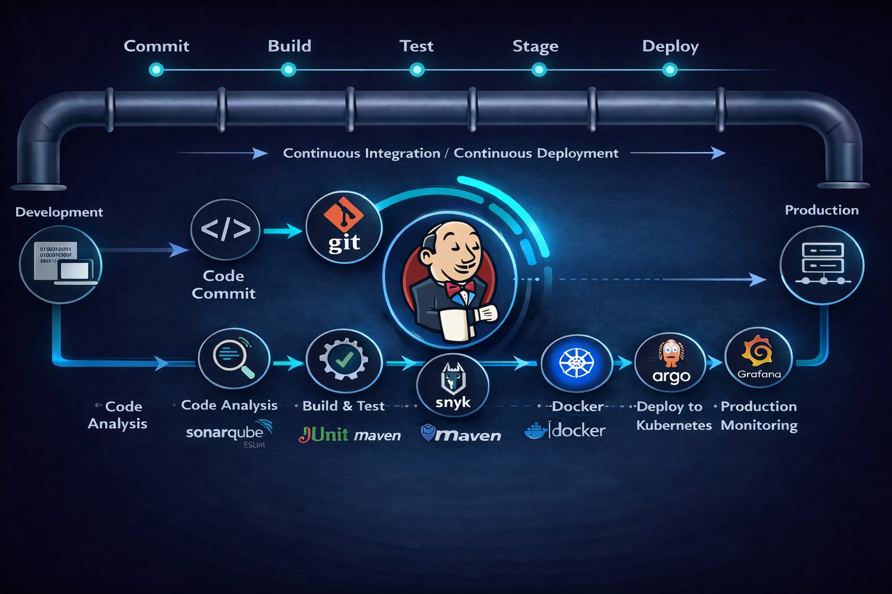
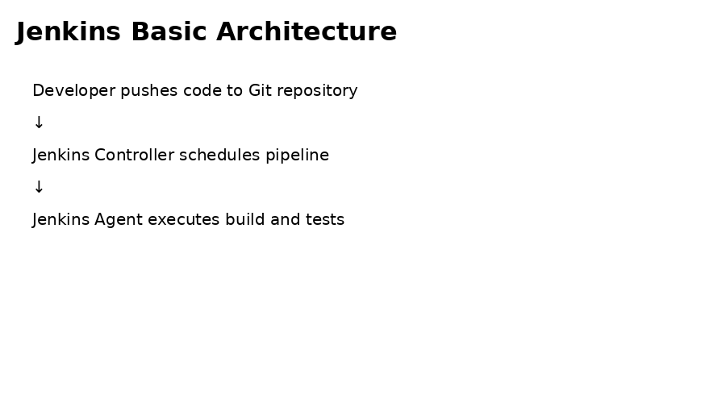
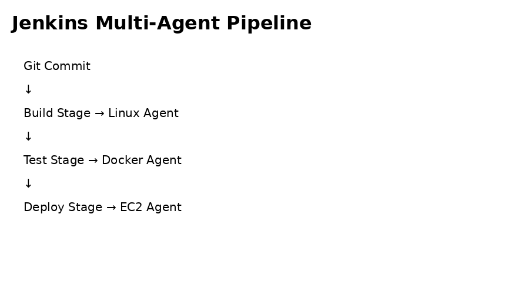
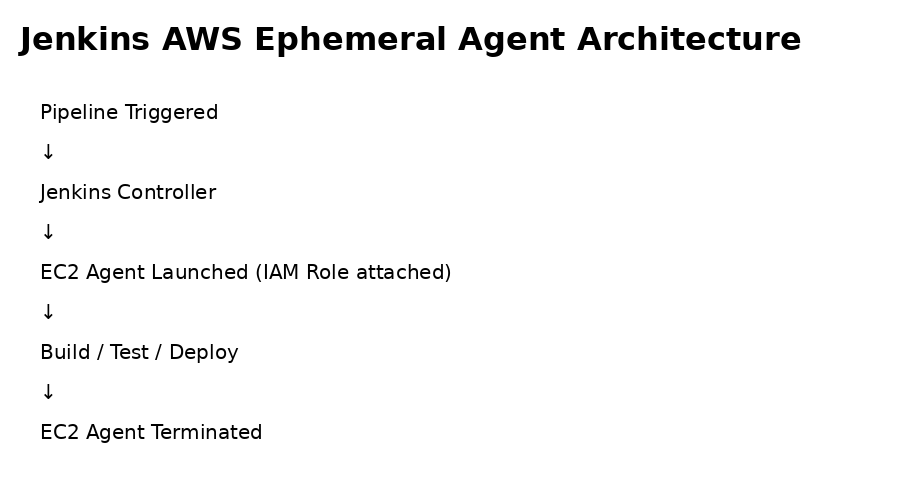
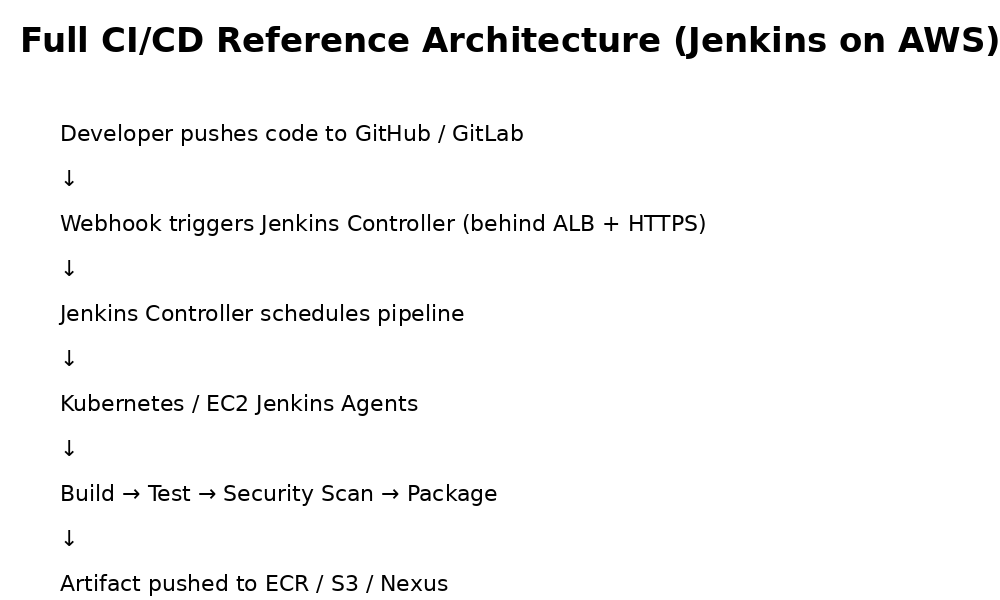
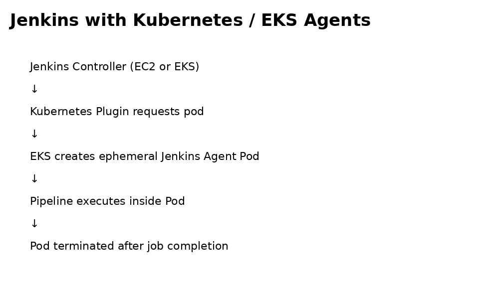
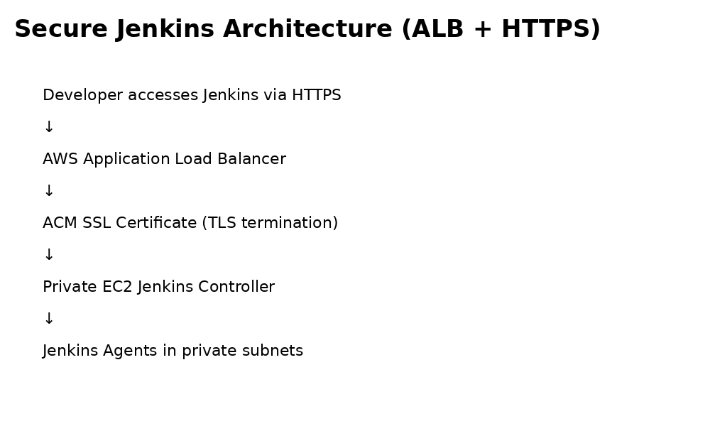

# 🚀 Jenkins LTS on Amazon Linux 2023 (AWS EC2)

Welcome! 👋  
This repository is a **gold‑standard, community‑friendly guide** to installing **Jenkins LTS (Long‑Term Support)** on **Amazon Linux 2023** running on **AWS EC2**.

Whether you're **new to Jenkins**, preparing for **DevOps interviews**, or setting up **real-world CI/CD**, this guide is designed to be:
- ✅ Easy to follow  
- 🔐 Security-aware  
- ☁️ AWS‑aligned  
- 🧠 Production-minded

---

## 🔁 CI/CD Pipeline



---

## 🌟 Why This Guide?

Most Jenkins tutorials online:
- ❌ Use outdated OS versions  
- ❌ Install weekly (unstable) Jenkins builds  
- ❌ Store AWS access keys insecurely  
- ❌ Ignore AWS + Linux 2023 realities  

This guide fixes all of that.

---

## 🧰 What You’ll Learn

✔ Install **Jenkins LTS (Stable)**  
✔ Use **Amazon Linux 2023** correctly (`dnf`, not legacy yum)  
✔ Configure **Java 21 (Amazon Corretto)**  
✔ Manage Jenkins via **systemd**  
✔ Upgrade Jenkins safely (LTS only)  
✔ Follow **real DevOps best practices**

---

## 🗺️ Architecture Overview

```
Developer → Browser → Jenkins (EC2)
                     |
                     └── /var/lib/jenkins (EBS gp3)
```

🔒 Optional: Jenkins behind ALB + HTTPS  
☁️ Optional: Jenkins agents on EC2 / Docker

---

## 📋 Prerequisites

Before you start, make sure you have:

- ☁️ **AWS Account**
- 🖥️ **EC2 Instance**
  - OS: Amazon Linux 2023
  - Type: `t3.medium` or higher (recommended)
- 🔐 **Security Group**
  - SSH (22) → Your IP
  - Jenkins (8080) → Your IP / ALB
- 🔑 **EC2 Key Pair**
- 🎭 **IAM Role attached to EC2** (recommended)

---

## 🔌 Step 1: Connect to EC2

```bash
ssh -i my-key.pem ec2-user@<EC2_PUBLIC_IP>
```

✅ If this works, you’re ready to go!

---

## 🔄 Step 2: Update the System

```bash
sudo dnf update -y
```

📌 If kernel updates occur:
```bash
sudo reboot
```

Reconnect after reboot.

---

## ☕ Step 3: Install Java (Mandatory)

Jenkins LTS officially supports:
- ✅ Java 17
- ✅ Java 21 (recommended)

We’ll use **Amazon Corretto 21** 👇

```bash
sudo dnf install java-21-amazon-corretto -y
```

Verify:
```bash
java -version
```

Expected output:
```
openjdk version "21"
```

---

## 📦 Step 4: Add Jenkins LTS Repository

⚠️ **IMPORTANT:** This is the **LTS repo**, not weekly builds.

```bash
sudo wget -O /etc/yum.repos.d/jenkins.repo \
https://pkg.jenkins.io/rpm-stable/jenkins.repo
```

🔑 Import Jenkins GPG key:
```bash
sudo rpm --import https://pkg.jenkins.io/rpm-stable/jenkins.io-2026.key
```

Verify:
```bash
dnf repolist | grep jenkins
```

---

## 🧩 Step 5: Install Jenkins LTS

```bash
sudo dnf install jenkins -y
```

Check version:
```bash
jenkins --version
```

You should see something like:
```
2.4xx.x (LTS)
```

🎉 Congrats — Jenkins LTS is installed!

---

## ▶️ Step 6: Start Jenkins

```bash
sudo systemctl daemon-reload
sudo systemctl enable jenkins
sudo systemctl start jenkins
```

Check status:
```bash
sudo systemctl status jenkins
```

---

## 🌐 Step 7: Open Jenkins UI

Open your browser:

```
http://<EC2_PUBLIC_IP>:8080
```

If it loads — you’re winning 🏆

---

## 🔓 Step 8: Unlock Jenkins

Get the initial admin password:

```bash
sudo cat /var/lib/jenkins/secrets/initialAdminPassword
```

Paste it into the UI.

---

## ⚙️ Step 9: First-Time Setup

1️⃣ Click **Install suggested plugins**  
2️⃣ Create your **Admin User**  
3️⃣ Save & Finish  

🎊 Jenkins is now ready!

---

## 🔍 Step 10: Confirm LTS Version

In Jenkins UI:
```
Manage Jenkins → About Jenkins
```

You should see:
```
Jenkins 2.xxx.x (LTS)
```

---

## ⬆️ Upgrading Jenkins (Safe & LTS Only)

```bash
sudo dnf upgrade jenkins -y
sudo systemctl restart jenkins
```

✅ This will **never** install weekly builds.

---

## 🔐 Production Best Practices (Highly Recommended)

✔ Use **IAM Roles** (no AWS access keys in Jenkins)  
✔ Restrict port **8080**  
✔ Use **ALB + HTTPS**  
✔ Backup `/var/lib/jenkins` via **EBS snapshots**  
✔ Use **gp3 EBS volumes (30–50GB+)**  
✔ Monitor CPU & memory (Jenkins loves RAM)

---

## 🧠 Common Mistakes to Avoid

❌ Installing Jenkins Weekly  
❌ Using `yum` blindly on AL2023  
❌ Running Jenkins on `t2.micro`  
❌ Storing AWS secrets in Jenkins UI  
❌ Exposing Jenkins publicly without auth  

---

## 🧪 Tested On

| Component | Version |
|---------|--------|
Amazon Linux | 2023 |
Java | Corretto 21 |
Jenkins | LTS |
AWS | EC2 |

---

## 🚀 What’s Next?

Want to level up? Try:
- Jenkins behind **ALB + HTTPS**
- **EC2 auto-scaling Jenkins agents**
- Jenkins with **Docker**
- Jenkins on **EKS**
- CI/CD pipelines (Maven, Gradle, Node.js)

---

## 📚 References

- Jenkins Docs → https://www.jenkins.io/doc/
- Jenkins RPM Repo → https://pkg.jenkins.io/
- Amazon Linux 2023 → https://docs.aws.amazon.com/linux/

---


---

# 🧠 Jenkins & CI/CD — Community Learning Notes

This section explains **Jenkins fundamentals and CI/CD concepts** in a practical, beginner-friendly way.  
Perfect if you're **learning Jenkins**, preparing for **interviews**, or building **real pipelines**.

---

## 🚀 What is Jenkins?

Jenkins is an **open-source automation server** used to build, test, and deploy applications through automated pipelines.

> 🏭 *Think of Jenkins as a factory that converts source code into production-ready software.*

---

## 🌟 Why Jenkins is Widely Used

- 🔓 Open-source and free
- 🧩 1800+ plugins
- ☁️ Strong cloud support (AWS, Azure, GCP)
- 🔁 Excellent CI/CD capabilities
- 🌍 Massive community adoption

---

## 🏗️ Jenkins Architecture (Simple View)

```
Developer → Git Repository → Jenkins Controller
                               |
                               ├── Agent 1 (Build)
                               ├── Agent 2 (Test)
                               └── Agent 3 (Deploy)
```

### Key Components
- **Controller (Master)**  
  Manages UI, pipelines, scheduling, credentials
- **Agents (Workers)**  
  Execute jobs (EC2, Docker, Kubernetes, on-prem)

✅ Best practice: Keep workloads off the controller.

---

## ⚙️ Jenkins Jobs vs Pipelines

| Feature | Freestyle Job | Pipeline |
|------|---------------|----------|
| Configuration | UI-based | Code-based |
| Version control | ❌ | ✅ |
| Scalability | ❌ | ✅ |
| Recommended | ❌ Legacy | ✅ Yes |

👉 **Always use Pipelines**

---

## 📄 Jenkinsfile (Pipeline as Code)

A `Jenkinsfile` defines the pipeline and lives inside your Git repository.

```groovy
pipeline {
  agent any
  stages {
    stage('Build') {
      steps {
        echo 'Building...'
      }
    }
    stage('Test') {
      steps {
        echo 'Testing...'
      }
    }
    stage('Deploy') {
      steps {
        echo 'Deploying...'
      }
    }
  }
}
```

### Benefits
- 📦 Version controlled
- 🔁 Repeatable
- 🔐 Auditable

---

## 🔁 CI/CD Explained

### 🔹 Continuous Integration (CI)
- Developers merge code frequently
- Every commit triggers:
  - Build
  - Test
  - Validation

🎯 Goal: Catch issues early.

---

### 🔹 Continuous Delivery vs Deployment

| Type | Description |
|----|-------------|
Continuous Delivery | Manual approval before prod |
Continuous Deployment | Fully automated to prod |

---

## 🔄 CI/CD Flow with Jenkins

```
Code Commit
   ↓
Jenkins Trigger
   ↓
Build
   ↓
Test
   ↓
Security Scan
   ↓
Deploy
```

Jenkins orchestrates this entire lifecycle.

---

## ☁️ Jenkins + AWS (Real-World Usage)

Common integrations:
- EC2 auto-scaling agents
- Docker & ECR
- ECS / EKS deployments
- S3 for artifacts
- CloudWatch monitoring

🔐 Best practice: Use **IAM Roles**, not access keys.

---

## 🔐 Jenkins Security Essentials

- Disable anonymous access
- Use Role-Based Access Control (RBAC)
- Store secrets in Jenkins Credentials
- Limit plugin installations
- Rotate credentials regularly

---

## 🚨 Common Anti-Patterns

❌ Running builds on controller  
❌ Using Jenkins weekly builds in production  
❌ Hardcoding secrets in Jenkinsfile  
❌ No backup strategy  
❌ Plugin overload  

---

## 🧪 Common Jenkins Use Cases

- CI pipelines
- Docker image builds
- Infrastructure automation
- Scheduled jobs (cron)
- GitOps workflows

---

## 🎯 Jenkins Interview Notes

- Jenkins is pull-based by default
- Pipelines use Groovy
- Jenkins is stateful
- LTS is recommended for production

---

## 🧠 Final Thoughts

Jenkins is **battle-tested**, not outdated.

When combined with:
- Pipelines as code
- Cloud-based agents
- Strong security practices

…it becomes a **powerful CI/CD engine**.

---


## 🖼️ Jenkins Architecture Diagrams

### Basic Jenkins Architecture


---

### Multi-Agent Jenkins Pipeline


---

### Jenkins with AWS Ephemeral EC2 Agents


---

# 🧩 Jenkins Controller & Agent (Master–Slave) Integration

In real-world CI/CD systems, Jenkins **should not run builds on the controller**.  
Instead, Jenkins uses **agents (formerly called slaves)** to execute workloads.

This section explains:
- 🔹 Jenkins Controller vs Agent
- 🔹 How to connect agents
- 🔹 Common Jenkins architectures
- 🔹 Basic real-world workflows

---

## 🧠 Jenkins Controller vs Agent

### Jenkins Controller (Master)
- Manages:
  - Web UI
  - Job configuration
  - Scheduling
  - Credentials
- ❌ Should NOT run heavy builds
- ❌ Should NOT compile or deploy code

### Jenkins Agent (Worker)
- Executes:
  - Builds
  - Tests
  - Deployments
- Can run on:
  - EC2
  - Docker containers
  - Kubernetes pods
  - On-prem servers

📌 **Golden Rule:**  
> Controller schedules, agents execute.

---

## 🏗️ Basic Jenkins Architecture

```
Developer
   ↓
Git Repository
   ↓
Jenkins Controller
   ↓
+-------------------+
| Jenkins Agents    |
|-------------------|
| EC2 Agent (Build) |
| Docker Agent      |
| K8s Agent         |
+-------------------+
```

---

## 🔌 Ways to Connect Jenkins Agents

| Method | Use Case |
|------|---------|
SSH | Static EC2 / VM agents |
Inbound (JNLP) | Dynamic / firewalled environments |
Docker | Ephemeral builds |
Kubernetes | Cloud-native CI/CD |

---

## 🔐 Prerequisites for Agent Setup

- Jenkins installed and running
- Agent machine reachable from controller
- Java installed on agent
- SSH access OR inbound agent port
- Correct credentials configured in Jenkins

---

## 🧪 Method 1: Add Jenkins Agent via SSH (Most Common)

### Step 1: Prepare Agent Machine
On the agent node:
```bash
sudo dnf install java-21-amazon-corretto -y
```

Ensure:
```bash
java -version
```

---

### Step 2: Add Agent in Jenkins UI

1. Go to **Manage Jenkins → Nodes & Clouds**
2. Click **New Node**
3. Enter:
   - Node name (e.g., `ec2-agent-1`)
   - Type: **Permanent Agent**

---

### Step 3: Configure Agent

| Field | Value |
|----|------|
Remote root directory | `/home/ec2-user/jenkins` |
Labels | `linux aws build` |
Usage | Use this node as much as possible |
Launch method | Launch agents via SSH |

---

### Step 4: SSH Configuration

- Host: Agent private IP / DNS
- Credentials:
  - Kind: SSH Username with private key
  - Username: `ec2-user`
  - Private Key: EC2 key or dedicated key

Click **Save** → Jenkins connects automatically.

✅ Status should turn **green**.

---

## 🚀 Method 2: Inbound Agent (JNLP)

Best for:
- Locked-down networks
- Kubernetes pods
- Dynamic agents

### Steps:
1. Create agent node
2. Select **Launch agent by connecting it to the controller**
3. Copy the generated command
4. Run on agent:
```bash
java -jar agent.jar -jnlpUrl <url> -secret <secret>
```

---

## 🐳 Method 3: Docker-Based Agents

Jenkinsfile example:
```groovy
pipeline {
  agent {
    docker {
      image 'maven:3.9.6-eclipse-temurin-21'
    }
  }
  stages {
    stage('Build') {
      steps {
        sh 'mvn clean package'
      }
    }
  }
}
```

Benefits:
- Clean builds
- No dependency pollution
- Reproducible environments

---

## ☁️ Method 4: EC2 Auto-Scaling Agents (AWS)

Typical flow:
```
Job Triggered
   ↓
Jenkins Controller
   ↓
EC2 Agent Launched
   ↓
Build Executed
   ↓
EC2 Agent Terminated
```

Best practice:
- Use **IAM Role**
- Use spot instances
- Keep agents ephemeral

---

## 🔄 Common Jenkins Workflows

### Workflow 1: Simple CI Pipeline
```
Git Push → Jenkins → Build → Test → Report
```

---

### Workflow 2: CI + CD Pipeline
```
Git Push
   ↓
Build
   ↓
Test
   ↓
Docker Image
   ↓
Deploy to Dev / QA
```

---

### Workflow 3: Multi-Agent Pipeline
```
Build (Linux Agent)
   ↓
Test (Docker Agent)
   ↓
Deploy (EC2 Agent)
```

---

## ⚠️ Common Mistakes

❌ Running builds on controller  
❌ Long-lived static agents without patching  
❌ Sharing one agent for all workloads  
❌ Hardcoding credentials on agents  

---

## 🧠 Best Practices (Gold Standard)

✔ Keep controller lightweight  
✔ Use labels to target agents  
✔ Prefer ephemeral agents  
✔ Use IAM Roles on AWS  
✔ Separate build & deploy agents  

---

## 🎯 Final Note

If Jenkins is:
- Slow ❌
- Unstable ❌
- Hard to scale ❌  

…it’s usually an **agent architecture problem**, not Jenkins itself.

---


---

# 🧪 End-to-End Jenkins Pipeline Examples

This section provides **realistic, end-to-end Jenkins pipelines** that demonstrate how Jenkins is used in real CI/CD systems.
Each example includes:
- 🧠 Architecture flow
- 📄 Sample `Jenkinsfile`
- 🎯 When to use it

---

## 🔹 Pipeline 1: Simple CI Pipeline (Build + Test)

### 📌 Use Case
- Java / Node / Python projects
- Early-stage CI
- Pull request validation

### 🔄 Architecture Flow
```
Developer → Git Push
     ↓
Jenkins Controller
     ↓
Linux Agent
     ↓
Build → Test → Report
```

### 📄 Jenkinsfile
```groovy
pipeline {
  agent any
  stages {
    stage('Checkout') {
      steps {
        git 'https://github.com/example/repo.git'
      }
    }
    stage('Build') {
      steps {
        echo 'Building application...'
      }
    }
    stage('Test') {
      steps {
        echo 'Running tests...'
      }
    }
  }
}
```

---

## 🔹 Pipeline 2: CI + CD Pipeline (Docker + Deployment)

### 📌 Use Case
- Microservices
- Container-based workloads
- Dev / QA deployments

### 🔄 Architecture Flow
```
Git Push
  ↓
Jenkins Controller
  ↓
Docker Agent
  ↓
Build → Test → Docker Image → Deploy
```

### 📄 Jenkinsfile
```groovy
pipeline {
  agent {
    docker {
      image 'docker:26'
    }
  }
  environment {
    IMAGE_NAME = 'myapp:latest'
  }
  stages {
    stage('Build') {
      steps {
        sh 'docker build -t $IMAGE_NAME .'
      }
    }
    stage('Test') {
      steps {
        sh 'echo Running container tests'
      }
    }
    stage('Deploy') {
      steps {
        sh 'echo Deploying to environment'
      }
    }
  }
}
```

---

## 🔹 Pipeline 3: Multi-Agent Pipeline (Best Practice)

### 📌 Use Case
- Large systems
- Separation of concerns
- Faster pipelines

### 🔄 Architecture Flow
```
Git Push
  ↓
Build (Linux Agent)
  ↓
Test (Docker Agent)
  ↓
Deploy (EC2 Agent)
```

### 📄 Jenkinsfile
```groovy
pipeline {
  agent none
  stages {
    stage('Build') {
      agent { label 'linux' }
      steps {
        echo 'Building on Linux agent'
      }
    }
    stage('Test') {
      agent { label 'docker' }
      steps {
        echo 'Testing inside Docker agent'
      }
    }
    stage('Deploy') {
      agent { label 'aws-ec2' }
      steps {
        echo 'Deploying from EC2 agent'
      }
    }
  }
}
```

---

## 🔹 Pipeline 4: AWS-Style Ephemeral Agent Pipeline

### 📌 Use Case
- Cost optimization
- Secure builds
- Auto-scaling workloads

### 🔄 Architecture Flow
```
Pipeline Triggered
  ↓
Jenkins Controller
  ↓
EC2 Agent Created
  ↓
Build / Test / Deploy
  ↓
EC2 Agent Terminated
```

### 📄 Jenkinsfile
```groovy
pipeline {
  agent { label 'ec2-ephemeral' }
  stages {
    stage('Build') {
      steps {
        echo 'Building on ephemeral EC2 agent'
      }
    }
    stage('Deploy') {
      steps {
        echo 'Deploying application'
      }
    }
  }
}
```

---

## 🧠 Key Takeaways

✔ Always use **pipelines as code**  
✔ Separate build, test, and deploy stages  
✔ Prefer **ephemeral agents**  
✔ Use labels to control execution  
✔ Keep Jenkins controller lightweight  

---
## 🖼️ CI/CD Reference Architectures

### Full CI/CD Reference Architecture (Jenkins on AWS)


---

### Jenkins with Kubernetes / EKS Agents


---

### Secure Jenkins Architecture (ALB + HTTPS)


---

## 🏷️ License

MIT License  
Feel free to fork, share, and help the community ❤️

---

⭐ **If this repo helped you, give it a star!** ⭐
